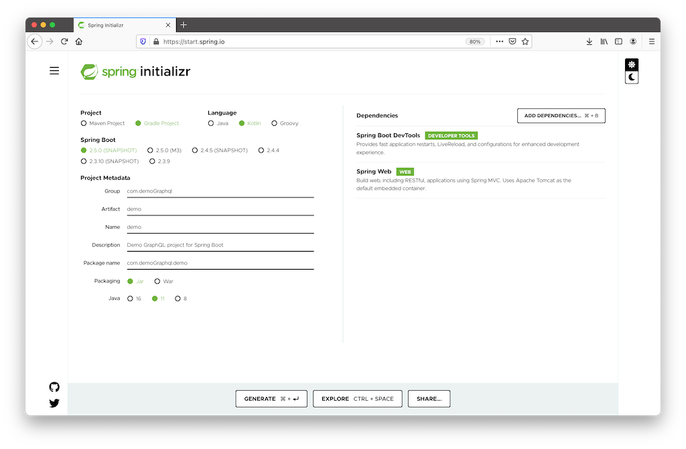
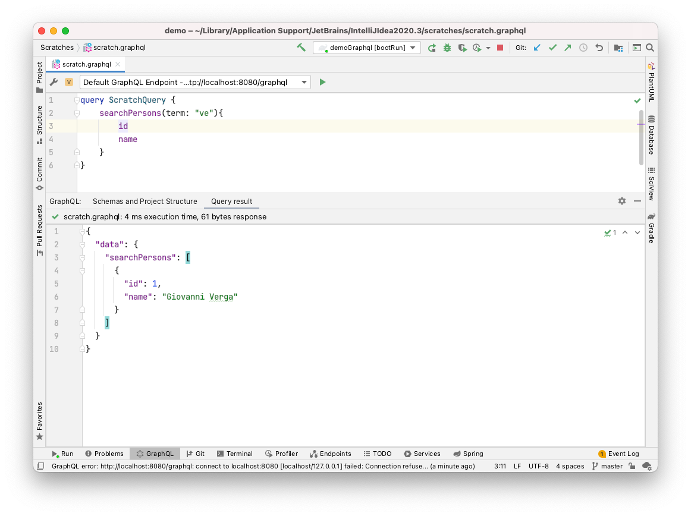
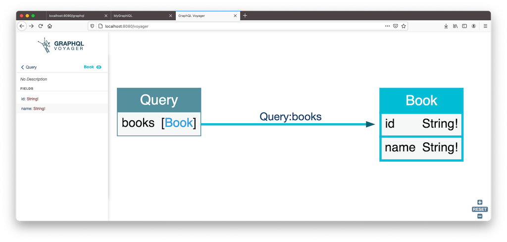

# Spring Boot, Kotlin, GraphQL and GraphiQL

Little Demo with nested objects to try the GraphQL world.

Started from link on YT https://www.youtube.com/watch?v=8JPqjx96VGE

### Setup

Started from Spring Initializr.

### Plugin

IntelliJ has a plugin to work with GraphQL.

### Voyager

You can also see Voyager installed 

### TODO

- Create a client app to query GraphQL server
